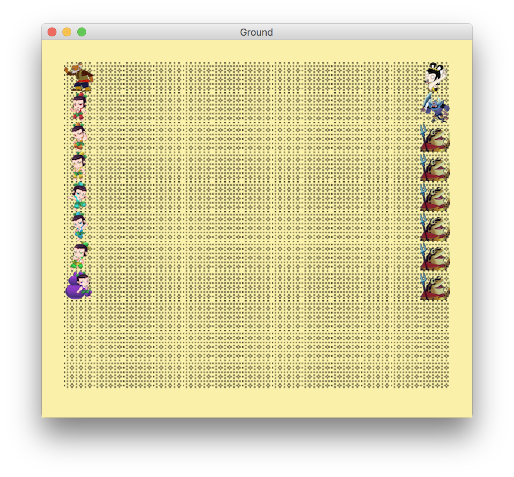
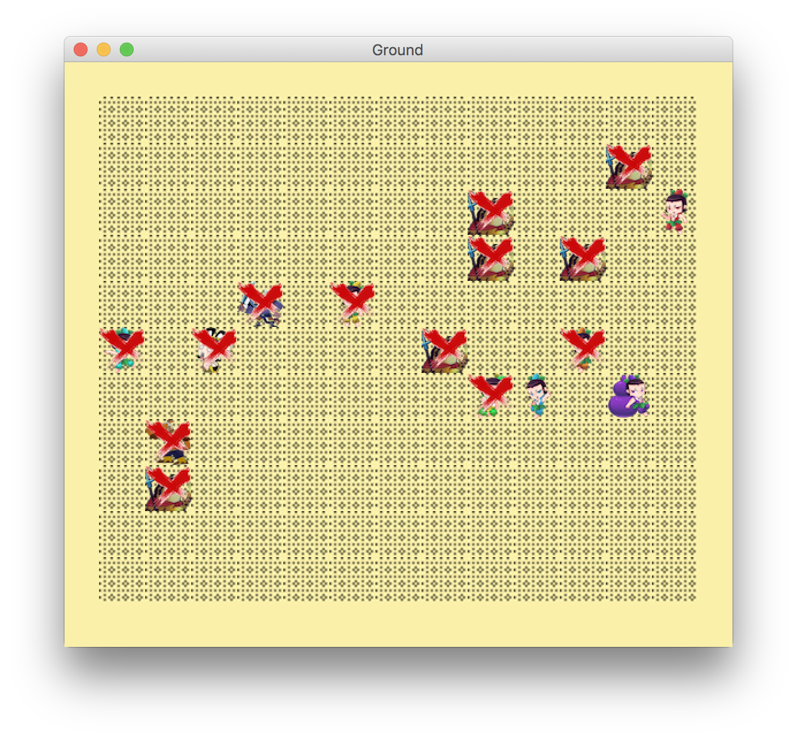

# Huluwa

这是一个讲述葫芦娃大战妖精故事的程序

## 游戏过程

### 1、游戏开始

### 2、按空格键开始战斗

原本分别排列成一字长蛇阵的正邪双方，开始随机移动。当然
* Player们不能超出战场范围
* 一个格子中只能站立一个Player
* Player每次可以向自己所在九宫格的另外8个格子移动，或者选择静止不动。

#### 战斗规则

当“我”想要移动到一个格子中，但是这个格子已经有人占了，这个人是敌人，且这是个活着的敌人，那么“我”和他开始战斗。由于“我”先手，有先发优势，所以“我”有70%的概率获胜。每一个Player死后会留下尸体(尸体肯定是不会移动的)，且尸体上会有“❌”出现表示死亡。战斗异常激烈，不死不休，直至某一方全部阵亡，战斗停止，还活着的Player也不会再移动了。

### 3、按R键恢复至战斗开始局面

这没什么好说的

### 4、关于进程安全

每一个Player都是一个单独的进程，在访问战场position时要特别注意进程安全问题。

举例：葫芦娃“老七”想要移动到(7,4)格子，则先对(7,4)格子进行加锁，然后再判断该格子是否为空，若空，则对自己目前所在的格子加锁后将目前的格子释放，最后将自己移动到(7,4)格子中。
